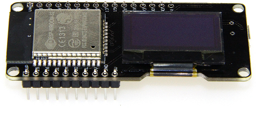
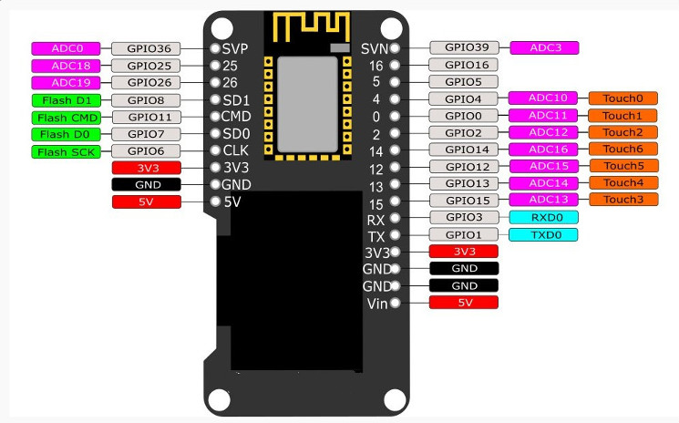

# wemos-lolin-esp32

## Board

## Pinout

I2C: Pin 5 is SDA, Pin 4 is SCL

## Technical details

* [ESP-WROOM-32 Datasheet.][4]
* https://www.esp32.com

## Resources

* https://github.com/espressif/arduino-esp32
* [Adafruit's page about ESP-WROOM-32.][5]

## Notes

* [Wemos Forum. Lolin32.][1]
* [Fake Wemos Lolin ESP32 with OLED.][2]
* [D-duino-32(ESP32&0.96OLED display).][3] Tindie.

[1]: https://forum.wemos.cc/category/6/lolin32
[2]: https://forum.wemos.cc/topic/372/fake-wemos-lolin-esp32-with-oled
[3]: https://www.tindie.com/products/lspoplove/d-duino-32esp32-and-096oled-display/
[4]: https://espressif.com/sites/default/files/documentation/esp_wroom_32_datasheet_en.pdf
[5]: https://www.adafruit.com/product/3320
